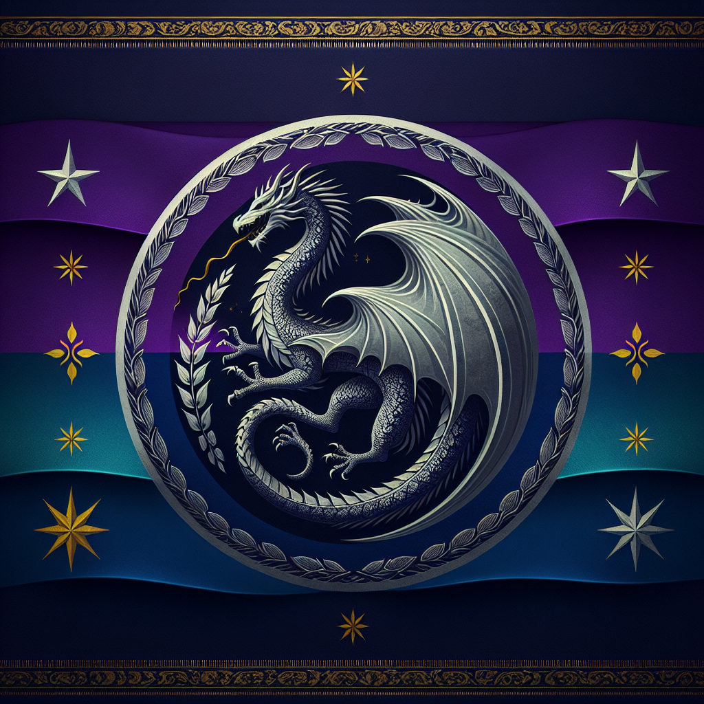

# Eltheria Overview

## Eltheria Overview

Eltheria is an enchanting island known for its ethereal landscapes, ancient elven architecture, and a deep connection to mystical forces. The island features lush, expansive forests in its interiors and pristine, wild coastlines. It serves as a sanctuary for elves and other magical beings who live in harmony with the natural world.

## Eltherian Flag

### Ports in Eltheria

#### Silvermoon Harbor

**Description:**  
Silvermoon Harbor is a significant port located near the heart of Eltheria, known for its luminescent whitewood structures that glow under the moonlight. It is both a commercial hub and a sacred site, reflecting the elves' reverence for the moon and stars.

**Key Features:**
- **Moonlight Docks:** Named for their ability to reflect moonlight, making the harbor visible from miles away at night.
- **Trader’s Crescent:** A bustling marketplace where exotic goods from distant lands are traded alongside local crafts and magical items.
- **The Moon Temple:** A beautiful temple dedicated to lunar deities, frequented by pilgrims and locals alike.

#### Windwhisper Port

**Description:**  
Situated on the eastern coast, Windwhisper Port is known for its seamless integration of natural beauty and elven craftsmanship. The port specializes in shipbuilding, particularly vessels designed for both sea and sky.

**Key Features:**
- **Elven Shipwright Yards:** These yards produce some of the most sophisticated ships, known for their elegance and durability.
- **Clifftop Lookouts:** Offer stunning views over the ocean, popular with both locals and tourists.
- **The Green Market:** A place where sustainable goods and magical trinkets are sold, promoting environmentally friendly commerce.

### Towns in Eltheria

#### Leafshade

**Description:**  
Nestled within the central forest of Eltheria, Leafshade is a town built among the ancient trees, connected by suspended walkways. It serves as a cultural and scholarly center, with a focus on elven history and the magical arts.

**Key Features:**
- **Great Library of Scrolls:** Houses an extensive collection of ancient texts and magical scrolls.
- **Mystic’s Hollow:** A secluded spot used for meditation and magical research.
- **Canopy Markets:** Unique marketplaces set in the treetops, offering goods that range from herbal remedies to artisan crafts.

#### Starfall

**Description:**  
Located in the northern hills, Starfall is noted for its clear skies and its commitment to the study of astronomy and astrology. The town attracts scholars and mystics from across the region.

**Key Features:**
- **Celestial Observatory:** Features advanced telescopic lenses for celestial observation and study.
- **Artisan’s Alley:** A vibrant street where local artisans sell crafts inspired by the cosmos.
- **Starlight Festival Grounds:** Hosts annual festivals celebrating celestial events, drawing crowds from across Eltheria.
