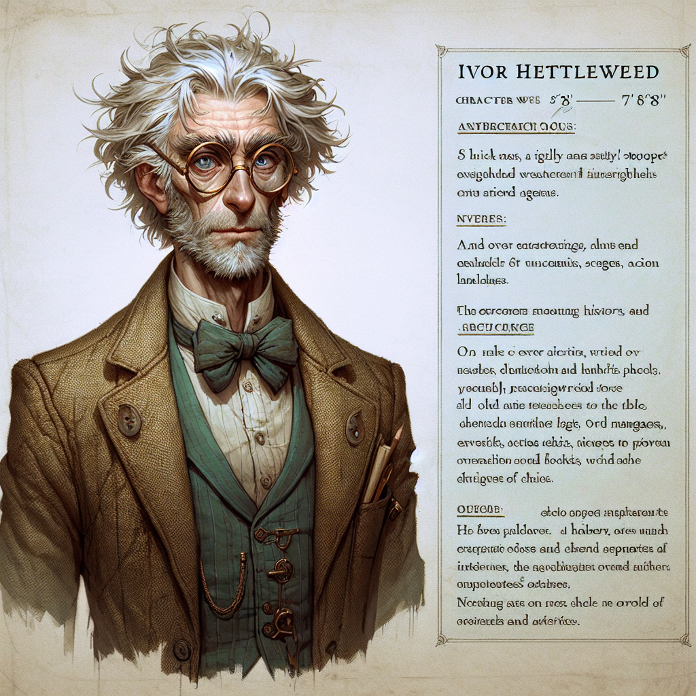

# Ivor Hettleweed

## Scholar, Historian...Eccentric!

**Name:** Ivor Hettleweed

## Appearance:
- **Height and Build:** Thin and slightly stooped, standing at about 5'8".
- **Hair:** A shock of white hair, often unkempt, suggesting a mind preoccupied with more important matters than personal grooming.
- **Eyes:** Sharp, inquisitive blue eyes that seem to sparkle with curiosity and intelligence behind his spectacles.
- **Glasses:** Round, wire-rimmed spectacles that often slip down his nose, requiring constant adjustment.
- **Clothing:** Usually dressed in a well-worn, tweed jacket with elbow patches, a buttoned-up waistcoat, and a slightly crumpled shirt. His attire hints at a man who values function over fashion.

## Personality:
- **Intellect:** Exceptionally intelligent with vast knowledge in various fields, especially history, alchemy, and ancient languages.
- **Eccentricity:** Known for his eccentric habits, such as talking to himself, making obscure references, and having odd experiments scattered around his workspace.
- **Curiosity:** Incredibly curious, always seeking to uncover hidden truths and forgotten lore. This sometimes leads him to take risks others would avoid.
- **Kind-hearted:** Despite his quirks, he has a kind heart and is always willing to help those in need, especially if it involves solving a mystery or uncovering knowledge.
- **Absent-minded:** Prone to moments of forgetfulness, often losing track of time or misplacing items in his cluttered study.

## Background:
- **Scholar and Historian:** Renowned for his extensive research and publications on ancient civilizations, forgotten legends, and historical artifacts.
- **Mad Scientist Reputation:** Gained a bit of a reputation for conducting bizarre and unconventional experiments, sometimes leading to unpredictable results.
- **Adventurous Past:** Has traveled extensively in his younger days, collecting rare artifacts and manuscripts from various corners of the world. His study is filled with these treasures, each with its own story.
- **Mentor:** Acts as a mentor to young scholars and adventurers, sharing his knowledge and occasionally involving them in his peculiar projects.

## Habits and Quirks:
- **Workspace:** His study is a chaotic mess of books, scrolls, odd devices, and mysterious artifacts. Despite the chaos, he seems to know exactly where everything is.
- **Speech:** Tends to speak in a rapid, excited manner, especially when discussing something he is passionate about. Often uses archaic or obscure terms.
- **Hobbies:** Enjoys solving puzzles, deciphering ancient texts, and creating strange concoctions in his laboratory.

## Role in the Story:
- **Advisor:** Provides crucial historical knowledge and insights that help progress the story or solve key mysteries.
- **Quest Giver:** May send characters on quests to retrieve rare artifacts or investigate ancient sites.
- **Resource:** Acts as a valuable resource for the protagonists, offering guidance, research assistance, and occasionally, unconventional gadgets or potions.
