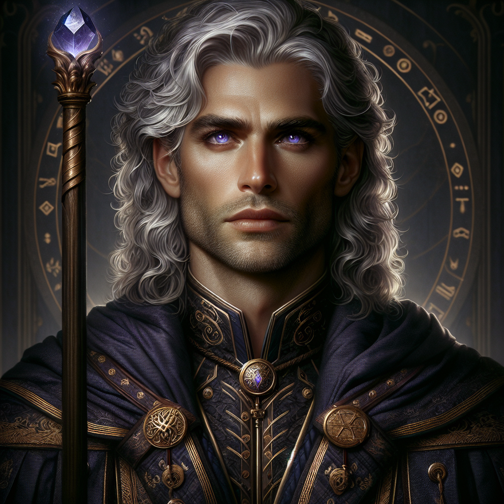
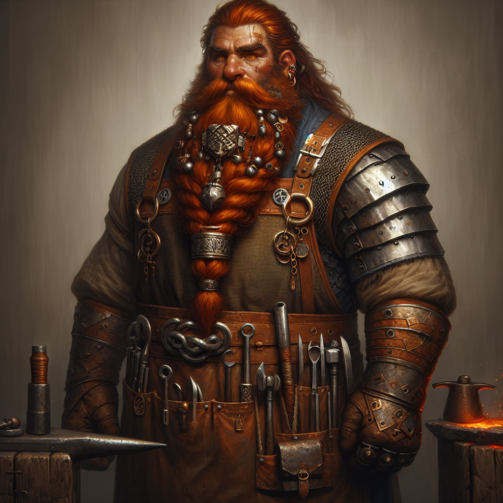
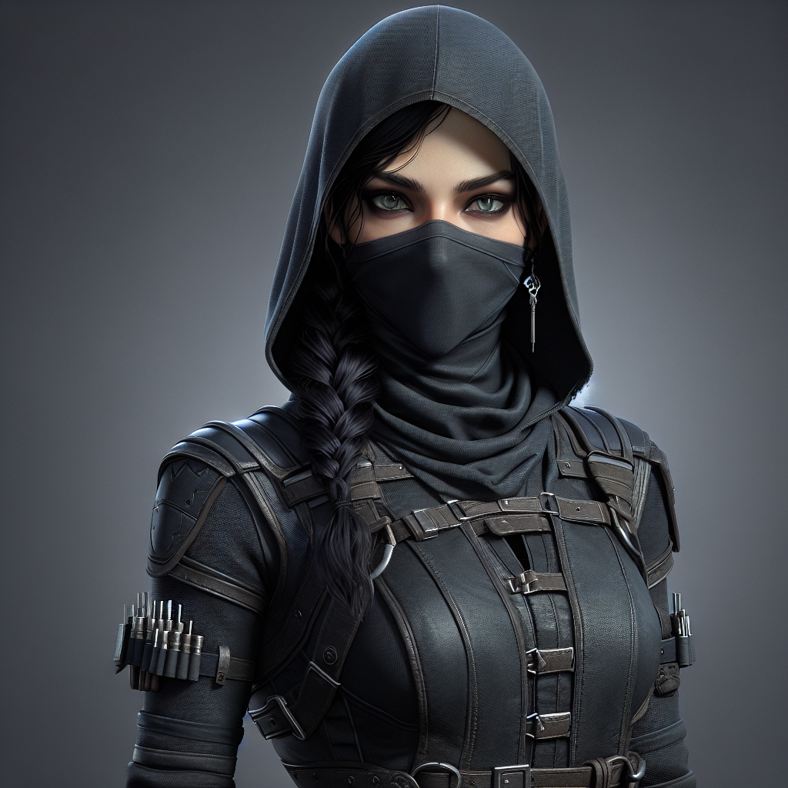

# People of the Doranth

## Welcome to Doranth, it's nice to meet you!

!!! success 

    As you embark on your journey through the vibrant city of Dorath and the surrounding lands, prepare to meet a diverse array of fascinating individuals, each with their own unique stories and roles. From brilliant mages and cunning merchants to legendary craftsmen and mysterious figures lurking in the shadows, the people you encounter will enrich your adventures with their wisdom, services, and sometimes intrigue. Engage with them, learn their stories, and discover how they can help you navigate and influence the complex tapestry of relationships and power dynamics in this richly detailed world.

---

!!! info "Notable People and Institutions in Doranth"

    #### Doranth hosts a variety of key figures whose expertise and establishments significantly shape the city's cultural and economic landscape. 

!!! quote
    
    Portrait of Archmage Elion Voss - Current Standing Archmage of Doranth

### Important Figures and Their Contributions in the Realm of Magic

| Name                | Role / Establishment                     | Contribution / Activity                                                                                      |
|---------------------|------------------------------------------|--------------------------------------------------------------------------------------------------------------|
| Archmage Elion Voss | Head of the Arcanum Council              | Plays a pivotal role in guiding the city’s magical policies, particularly in dimensional travel and portal research. |
| Mirabel the Mystic  | Owner of "Mirabel’s Mystical Emporium"   | Provides rare and unique magical items that cannot be found elsewhere, serving adventurers and locals alike.  |
| Professor Lyrin Thal| Educator at Doranth Magical Academy      | Crucial in the education and defense of the city, teaching magical defenses and warding spells to new mages.  |

### The Crafting and Commerce of Doranth

!!! quote

    Portrait of the Legendary Master Blacksmith - Korin ForgeFire

### Key Figures in the Craftsmanship and Trade Sectors

| Name                  | Role / Establishment        | Contribution / Activity                                                                                      |
|-----------------------|-----------------------------|--------------------------------------------------------------------------------------------------------------|
| Master Blacksmith Korin Forgefire | Blacksmith               | Renowned for his exquisite craftsmanship in weapons made from rare metals and magical alloys. His weapons are sought after for their superior quality and enchantments. |
| Ava Steelhand         | Proprietor of the Warrior’s Rest | Runs a hub for warriors seeking expert advice on weaponry and a good night's rest.                             |
| Merchant Lord Hamil   | Trade Influence             | Enriches the marketplace by influencing trade and economic policies with his extensive network and knowledge of market trends.  |

### The Underbelly and Unseen Forces of Doranth

 

!!! danger "Wanted!! Dangerous Fugitive"

    Master Thief Lynx is currently wanted by the Doranrth City Guard on muliple charges. She is considered armed and dangerous and under no circumstance should you attempt to apprehend her. Please report all sightings to the nearest city guard member or post immediately;

### Influential Figures in the City's Underworld and Magical Trade

| Name               | Role / Establishment        | Contribution / Activity                                                                                                     |
|--------------------|-----------------------------|-----------------------------------------------------------------------------------------------------------------------------|
| Master Thief Lynx  | Leader in Clandestine Operations | Controls much of the city's clandestine operations, involving espionage and black market dealings through her vast network. |
| The Keeper         | Headmaster of The Gloomwell Academy | Educates in the dark arts, wielding significant power and instilling both respect and fear in the shadows of academia.      |
| Silas Darkweb      | Operator of the Obsidian Market  | Runs a network dealing in powerful magical artifacts at the Obsidian Market, attracting scholars, sorcerers, allies, and adversaries. |

