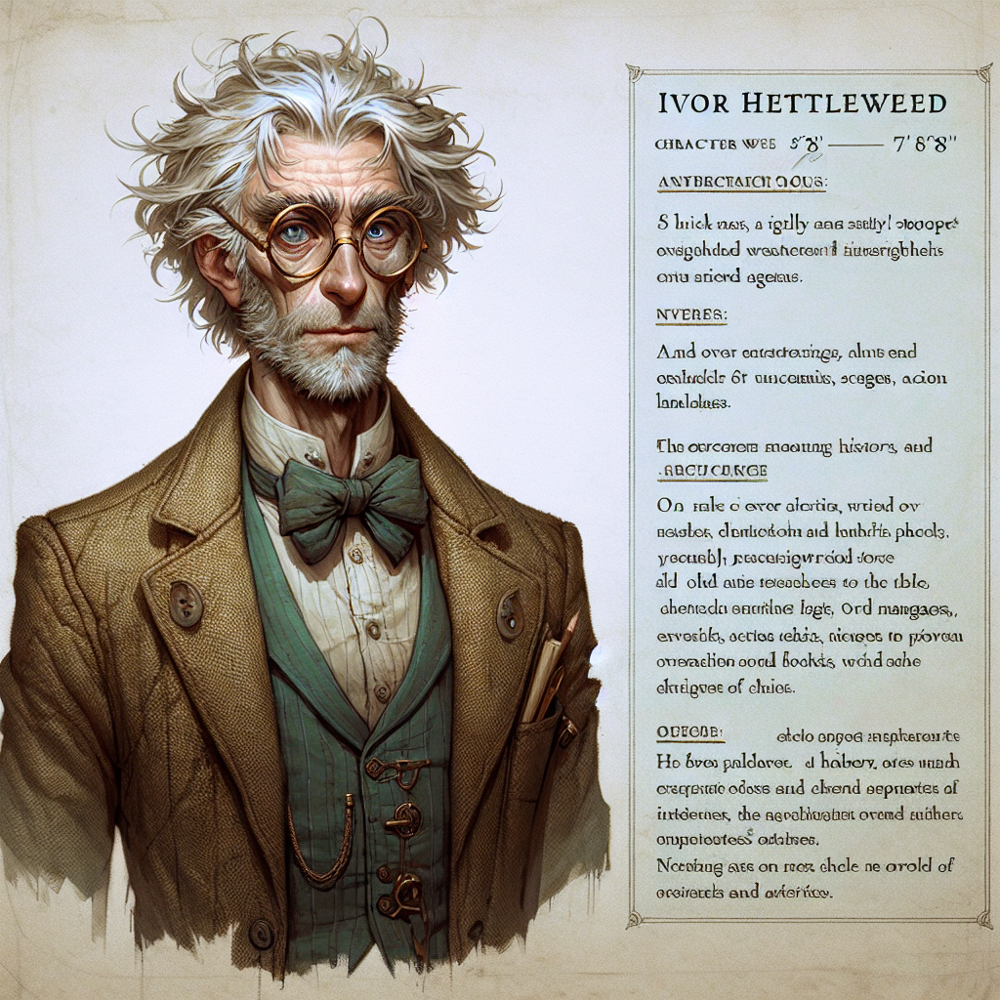

# People of the Doranth

## Welcome to Doranth, it's nice to meet you!

!!! success 

    As you embark on your journey through the vibrant city of Dorath and the surrounding lands, prepare to meet a diverse array of fascinating individuals, each with their own unique stories and roles. From brilliant mages and cunning merchants to legendary craftsmen and mysterious figures lurking in the shadows, the people you encounter will enrich your adventures with their wisdom, services, and sometimes intrigue. Engage with them, learn their stories, and discover how they can help you navigate and influence the complex tapestry of relationships and power dynamics in this richly detailed world.

---

!!! info "Notable People and Institutions in Doranth"

    #### Doranth hosts a variety of key figures whose expertise and establishments significantly shape the city's cultural and economic landscape. 

## Notable Figures of Doranth

### Doranth Representative Azilos Vreeleth - Character Profile

!!! info "His Story"

     In the bustling city of Doranth, where tradition intertwined deeply with the daily lives of its inhabitants, Azilos Vreeleth's rise was as unexpected as it was spectacular. Born into a modest family on the edge of the industrial sector, Azilos grew up surrounded by the clang of hammers and the roar of forges, a world away from the polished marble halls of Doranth's Council Chambers.

    Azilos was a reserved child, often found lost in books rather than playing in the streets with other children. His parents, simple workers in the textile mills, worried about his reclusive nature, but they could not deny his sharp mind and the light of curiosity in his eyes. As he grew older, Aziles’s interest shifted from the tales of ancient heroes to the workings of the city around him. His fascination with Doranth’s governance grew as he witnessed the struggles and triumphs of his community.

    When a scandal rocked the local political scene, with accusations of corruption and misdeeds pointing at several of the city’s seasoned representatives, the citizens of Doranth grew weary of the same old faces whose promises fell flat and whose actions benefited only the few. It was during this tumultuous time that Azilos, then a young scribe in the city’s archive, wrote a series of anonymous pamphlets. These writings, distributed secretly at first, criticized the current leadership and proposed new ideas for governance focused on transparency, community involvement, and innovation.

    The pamphlets caused a stir. Their popularity grew, and soon everyone from street vendors to high merchants was discussing the ideas laid out by the mysterious author. When Azilos finally stepped forward as the writer, there was an outpouring of support from unexpected quarters. His candid acknowledgment of his writings, coupled with his insightful critiques and suggestions, resonated with a populace eager for change.

    Support for his candidacy grew rapidly, and what started as a hesitant step into the public eye became a spirited campaign. Azilos’s youth, once seen as a disadvantage, became a symbol of the new beginning Doranth so desperately needed. His speeches, filled with a quiet passion and a clear vision for a revitalized governance, won over even the most cynical of his constituents.

    In a historic election marked by an unprecedented turnout, Azilos was elected the youngest representative in over two centuries. On the day of his inauguration, he stood before the people of Doranth, his long, wavy auburn hair and earnest blue eyes marking the visage of change. As he took his oath, the city seemed to hold its breath, ready at last to stride toward a future filled with hope.

    Thus began Azilos Vreeleth's tenure as a representative, a role he approached with the same thoughtfulness and dedication that had led an introspective young man from the shadows of the archives to the brightest spotlight in Doranthian politics.

### Azilos Vreeleth - Appearance Details

| **Attribute**  | **Details**       |
|----------------|-------------------|
| **Hair**       | Long, wavy, auburn |
| **Eyes**       | Blue              |
| **Beard**      | Thin, wispy       |
| **Skin**       | Tanned brown      |
| **Height**     | 179 cm (5′ 10″)   |
| **Build**      | Soft              |

### Ivor Hettleweed - Scholar, Historian...Eccentric!

!!! info "One Eccentric Guy..."

    Ivor Hettleweed, standing thin and slightly stooped at 5'8", is a figure synonymous with the arcane and the obscure. His unkempt shock of white hair and sharp, inquisitive blue eyes peeking through round, wire-rimmed spectacles make him a distinctive sight in the bustling markets and quiet libraries of Grendale. Ivor's attire, a well-worn tweed jacket with elbow patches over a waistcoat and a slightly crumpled shirt, speaks of a man whose mind is too occupied with higher thoughts to concern himself with mundane matters like fashion.

    From a young age, Ivor exhibited an exceptional intellect, his knowledge spanning the vast histories of forgotten civilizations, the intricate details of alchemy, and the complexities of ancient languages. His eccentricities are well-known; he often talks to himself or cites obscure references that only he understands, and his workspace is a chaotic collection of books, scrolls, and peculiar devices — a testament to a life dedicated to the pursuit of knowledge.

    His background as a scholar and historian is renowned, with volumes of published works on the legends and artifacts of antiquities. Ivor's reputation as a "mad scientist" stems from his unorthodox experiments that blur the line between genius and folly. Despite his absent-minded nature, often forgetting appointments or where he left his latest invention, Ivor's curious spirit has led him across continents. His adventures, driven by his quest to collect rare artifacts and decode ancient manuscripts, fill his study with exotic treasures, each with a story only Ivor could tell.

    Ivor's role in the local community and beyond is multifaceted: he is a mentor to young scholars and adventurers alike, guiding them through complexities they cannot yet understand. He also acts as an advisor, his historical insights proving invaluable in unraveling the mysteries that confound ordinary historians. To those brave enough to undertake them, Ivor offers quests to retrieve ancient artifacts or to investigate mysterious, often dangerous sites. Despite his quirks, Ivor's kind heart shines through in his readiness to assist anyone in need, especially if it involves a puzzle to be solved or a piece of history to be preserved.

    Thus, Ivor Hettleweed continues to be a pillar of arcane knowledge and a bridge between the past and present, his life a tapestry woven from the threads of history, magic, and a ceaseless curiosity about the world.
    
### Character Profile

| **Category**       | **Details**                                                                                                                                                                                                                                                                                                                                                   |
|--------------------|---------------------------------------------------------------------------------------------------------------------------------------------------------------------------------------------------------------------------------------------------------------------------------------------------------------------------------------------------------------|
| **Appearance**     | - **Height and Build:** Thin and slightly stooped, standing at about 5'8".  - **Hair:** A shock of white hair, often unkempt.  - **Eyes:** Sharp, inquisitive blue eyes behind spectacles.  - **Glasses:** Round, wire-rimmed spectacles.  - **Clothing:** Tweed jacket with elbow patches, waistcoat, crumpled shirt.                                          |
| **Personality**    | - **Intellect:** Exceptionally intelligent, knowledgeable in history, alchemy, ancient languages.  - **Eccentricity:** Eccentric habits, talks to himself, obscure references, odd experiments.  - **Curiosity:** Extremely curious, seeks hidden truths.  - **Kind-hearted:** Helpful, especially in knowledge-related matters.  - **Absent-minded:** Forgetful. |
| **Background**     | - **Scholar and Historian:** Renowned for research on ancient civilizations, legends, artifacts.  - **Mad Scientist Reputation:** Known for bizarre experiments.  - **Adventurous Past:** Extensive travels, artifact collection.  - **Mentor:** Mentors young scholars and adventurers.                                                                                          |
| **Habits and Quirks**| - **Workspace:** Chaotic study filled with books, scrolls, devices, artifacts.  - **Speech:** Rapid, excited, uses archaic terms.  - **Hobbies:** Solving puzzles, deciphering texts, crafting concoctions.                                                                                                                                                 |
| **Role in the Story**| - **Advisor:** Provides historical insights, helps solve mysteries.  - **Quest Giver:** Sends characters on artifact retrieval or investigative quests.  - **Resource:** Offers guidance, research assistance, gadgets, potions.                                                                                                                              |

