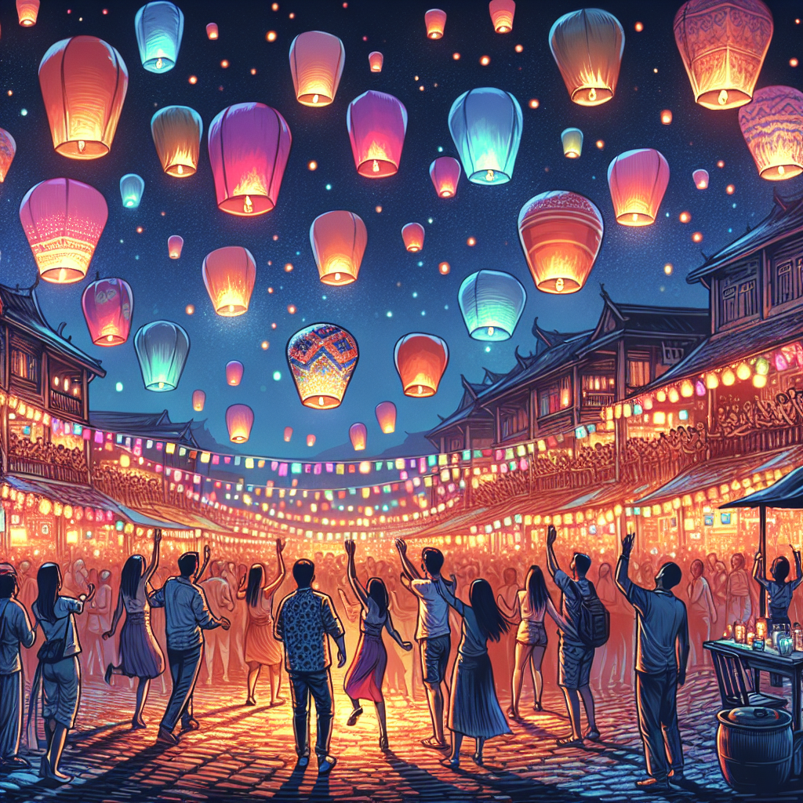
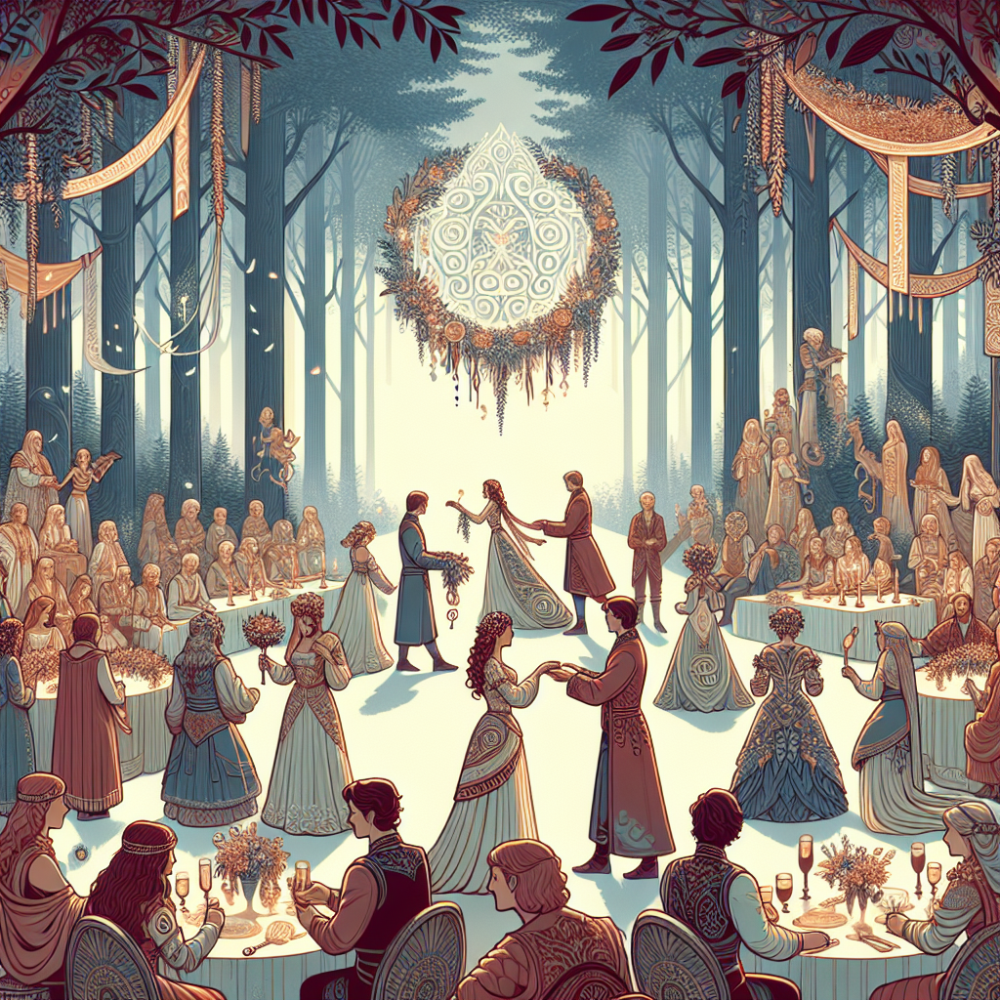
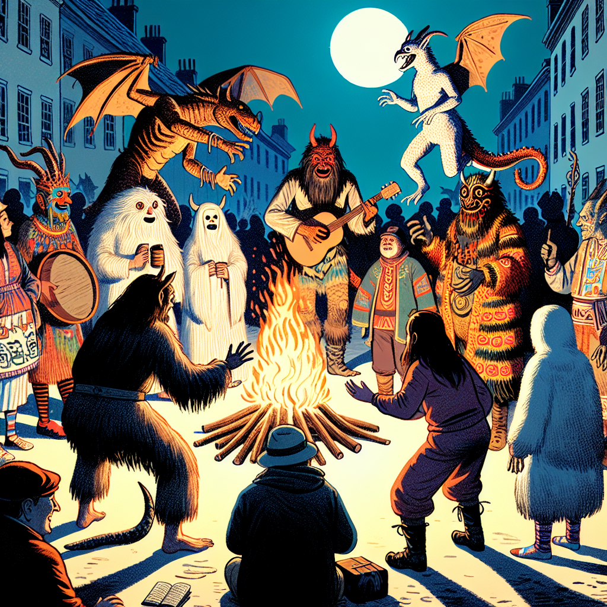
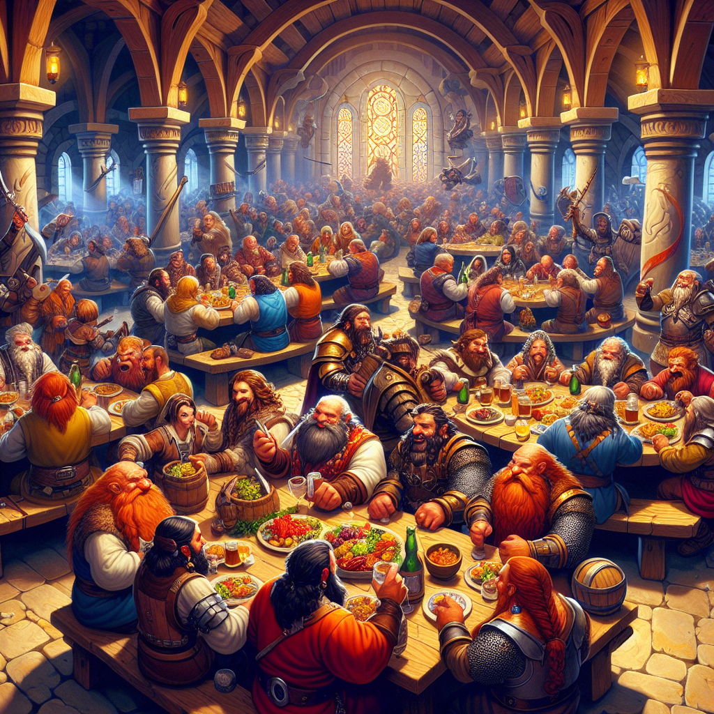
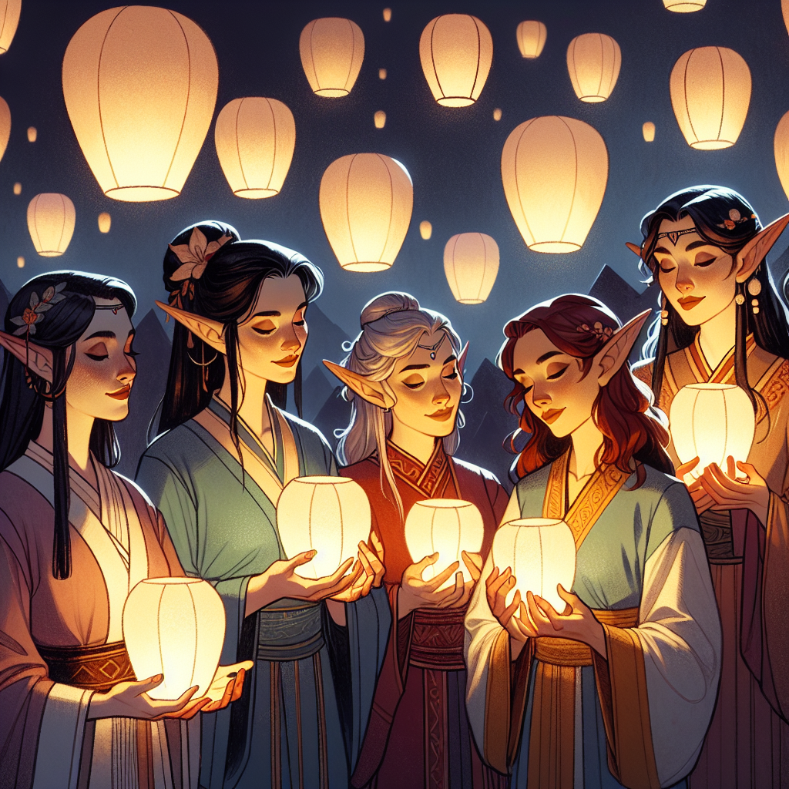

# Calendar and Holidays

## Doranth Seasonal Calendar

| Season         | Duration              | Key Events and Holidays                                                                                                                      | Description                                                                                                                                                                  |
|----------------|-----------------------|-----------------------------------------------------------------------------------------------------------------------------------------------|------------------------------------------------------------------------------------------------------------------------------------------------------------------------------|
| **Springtide** | 1st of Spring - 90th of Spring | **Day of Heartsong (14th of Spring's Blossom)**                                     | Springtide marks the rebirth of the world. Nature awakens with vibrant blooms, and the races celebrate renewal and love, culminating in the Day of Heartsong, a festival of love and artistic expression.                           |
| **Summertide** | 1st of Summer - 90th of Summer | None                                                                                                              | Summertide is a time of growth and prosperity. The days are long, and the nights are short. It’s a season for travel and trade, where most adventurers find themselves embarking on journeys and quests.                           |
| **Harvestide** | 1st of Harvest - 90th of Harvest | **Festival of Shadows (31st of Harvest's Moon)**; **Feast of Gratitude (25th of Harvest's End)**      | Harvestide brings the bounty of the land to the fore. It starts with the mysterious Festival of Shadows, celebrating the thin veil between worlds, and ends with the communal Feast of Gratitude, giving thanks for the harvest.   |
| **Wintertide** | 1st of Winter - 90th of Winter | **Eve of Echoes (30th of Winter's End)**; **Starlight Festival (21st of Winter's Peak)**                | Wintertide is the coldest season, a time of reflection and celebration. It begins with the reflective Eve of Echoes on the longest night, followed by the bright and hopeful Starlight Festival, celebrating the return of light. |

## Doranth Holidays

### Detailed Celebrations of Holidays by Race with Dates

| Holiday Name            | Date         | Race         | How They Celebrate                                                                                                                                                                                                                                                                                                                   |
|-------------------------|--------------|--------------|--------------------------------------------------------------------------------------------------------------------------------------------------------------------------------------------------------------------------------------------------------------------------------------------------------------------------------------|
| **Eve of Echoes**       | 30th of Winter's End | **Humans**   | Gather in town squares to tell heroic tales of the past year and release lanterns at midnight, symbolizing hopes for the year ahead. Parties often continue until dawn with music and dance.                                                                                                                                          |
|                         |              | **Elves**    | Perform elaborate rituals to communicate with ancestors and reflect on the past, using the night to meditate and seek wisdom for the future. Their celebrations are more subdued but deeply spiritual.                                                                                                                                 |
|                         |              | **Dwarfs**   | Host robust feasts in their halls, where tales of the past echo against stone walls. They focus on recounting the deeds of their ancestors, forging a link between the old and new years through story and song.                                                                                                                      |
| **Day of Heartsong**    | 14th of Spring's Blossom | **Humans**   | Celebrate with public declarations of love, grand gestures, and communal dances. The festival is loud, colorful, and joyous, with markets selling crafts and sweet treats.                                                                                                                                                           |
|                         |              | **Elves**    | Exchange intricately crafted artifacts and perform duets of ancient love songs in forests. Their celebration is elegant and mystical, with a focus on the timeless nature of love.                                                                                                                                                  |
|                         |              | **Dwarfs**   | Share deeply personal poems and songs written for loved ones in a more private setting. Dwarven celebrations are focused on family and close friends, often held within the home.                                                                                                                                                    |
| **Festival of Shadows** | 31st of Harvest's Moon | **Humans**   | Dress up as various mythical beings and roam the streets in groups, playing pranks and telling ghost stories. They also light bonfires to ward off evil spirits and gather around them to share tales of supernatural encounters.                                                                                                      |
|                         |              | **Elves**    | Use the night to honor the dead and the unseen. They hold silent vigils and create offerings of ethereal beauty, which they place in moonlit clearings.                                                                                                                                                                              |
|                         |              | **Dwarfs**   | Carve protective runes into stones and wood, placing them around homes and pathways to protect against spirits. Their celebrations are more about protection and respect for the spirit world than revelry.                                                                                                                          |
| **Feast of Gratitude**  | 25th of Harvest's End | **Humans**   | Organize large community feasts in village centers, sharing food and drink with all. Speeches and toasters are common, celebrating collective hard work and unity.                                                                                                                                                                   |
|                         |              | **Elves**    | Hold communal feasts in forest clearings, where food is shared freely with all creatures of the forest. Their appreciation extends to the natural world, showing gratitude for its bounty and beauty.                                                                                                                                 |
|                         |              | **Dwarfs**   | Gather in clan halls to enjoy hearty fare and recount the year's achievements through tales and songs. They emphasize craftsmanship and the fruits of their labor, showcasing new works.                                                                                                                                            |
| **Starlight Festival**  | 21st of Winter's Peak | **Humans**   | Celebrate with vibrant festivals filled with light displays and gift-giving at dawn. Communities gather to sing, exchange gifts, and decorate trees with symbols of their hopes for the new year.                                                                                                                                     |
|                         |              | **Elves**    | Observe the night with quiet reverence, lighting delicate lanterns that float on water and in the air, symbolizing the eternal dance of light and darkness. Their celebrations are serene and reflective.                                                                                                                            |
|                         |              | **Dwarfs**   | Hold a more solemn observance, lighting candles in their underground homes. They exchange gifts made of stone and metal, each crafted by the giver, to show the enduring strength and resilience of their race.                                                                                                                      |

## Artwork of Celebrations Past

!!! note "Eve of Echoes"

    Eve of Echoes as Celebrated by the Humans in years past

!!! note "Day of Heartsong"

    Day of Heartsong Depicted as celebrated by the elves in years past

!!! note "Festival of Shadow"

    The Festival of Shadows show celebrated by the Humans

!!! note "Feast of Gratitude"

    The Feast Of Gratitude depicted as celebrated by the Dwarfs

!!! note "Starlight Festival"

    The Starlight Festival as observed by the Elves of Doranth

