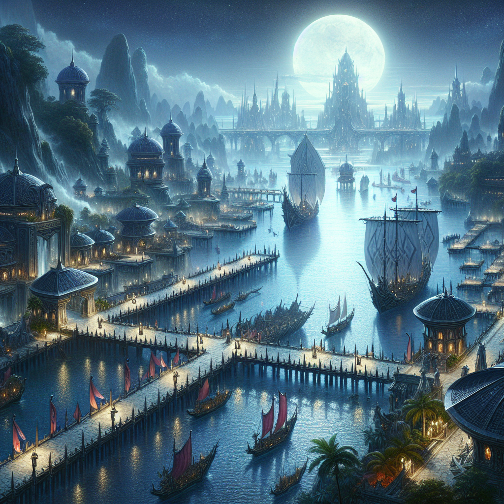
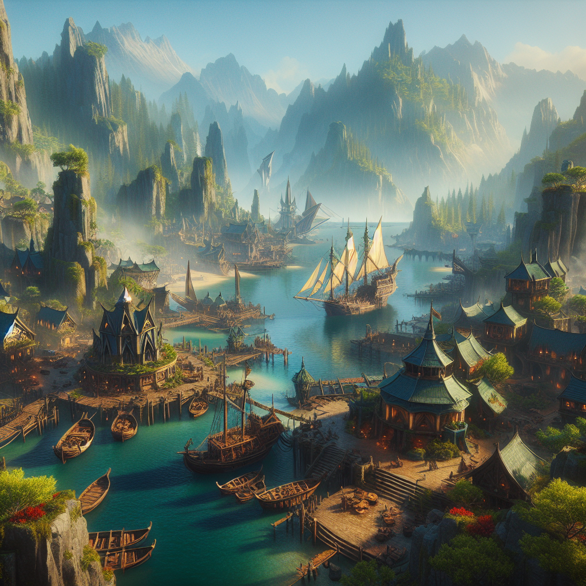
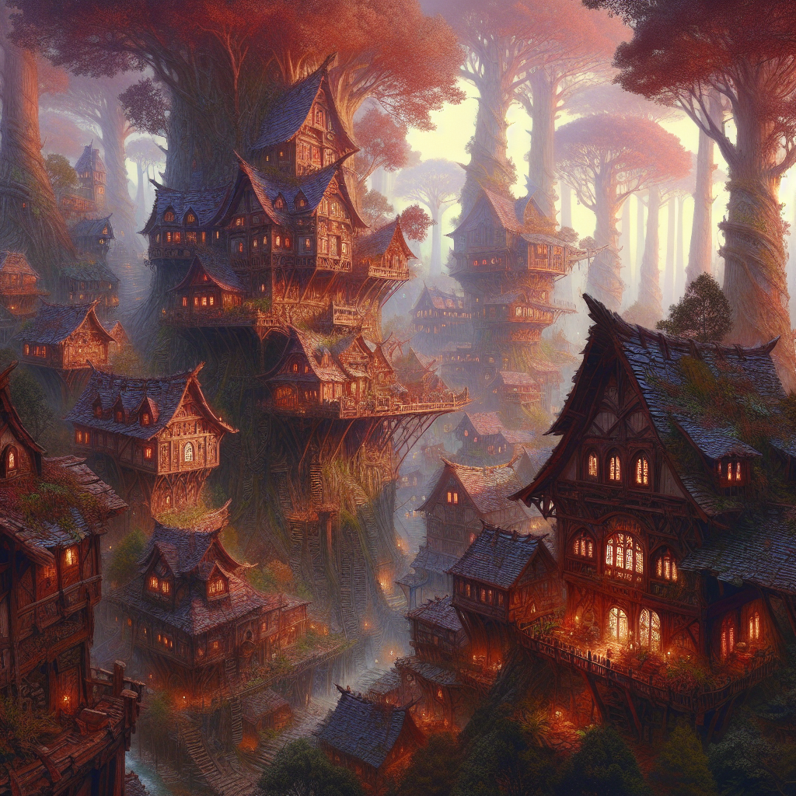
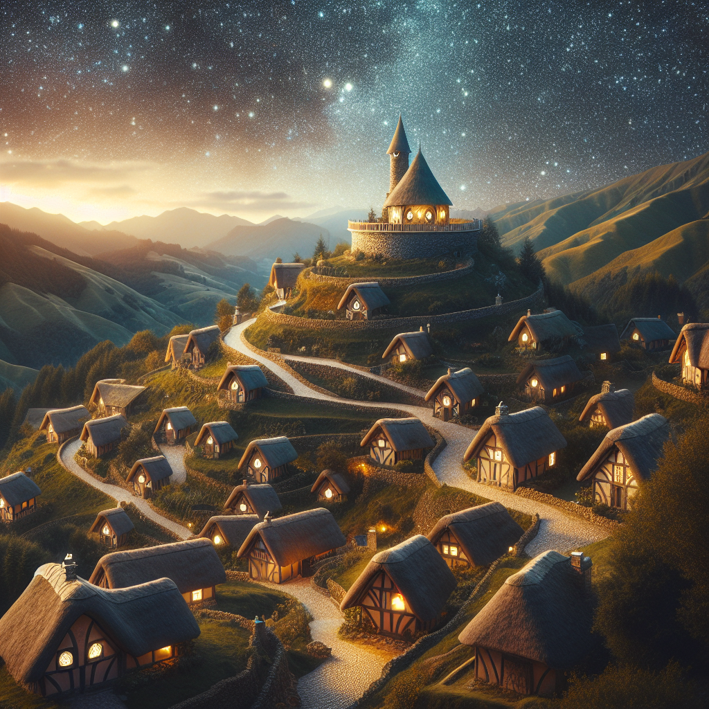
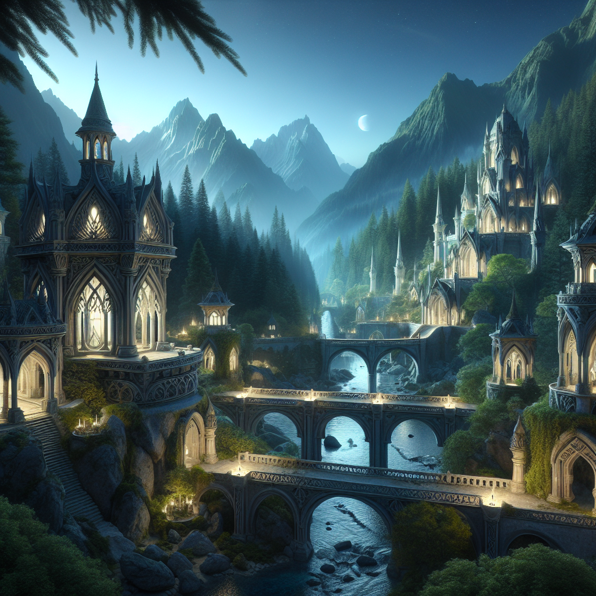

## Eltheria Ports and Towns

Eltheria is a mystical land dominated by elven cultures, celebrated for its vast ancient forests, majestic architecture, and a deep connection to magic and nature. Known for its harmony between the natural world and its inhabitants, Eltheria is a realm where preservation and wisdom are at the forefront of its long-lived societies.

### Ports in Eltheria

#### Silvermoon Harbor

 

**Description:**  
Silvermoon Harbor is a serene port built on the banks of a luminous lake that reflects the moonlight so brightly it appears silver. This port serves as both a hub for trade and a sacred site for the elves.

**Key Features:**
- **Moonlight Docks:** Constructed from whitewood, these docks glow under the moon, aiding night navigation.
- **Trader’s Crescent:** A bustling market for goods, crafts, and artifacts from across the world.
- **The Moon Temple:** A spiritual center located nearby, hosting moonlit ceremonies and pilgrimages.

**Cultural Significance:**  
Silvermoon Harbor is renowned for its peaceful ambiance and is a center for cultural festivals that celebrate the elves' connection to lunar cycles.

#### Windwhisper Port

**Description:**  
Situated on the western coast, nestled within towering cliffs and dense forests, Windwhisper Port is known for its shipwrights who meld magic with traditional craftsmanship.

**Key Features:**
- **Elven Shipwright Yards:** Famous for crafting swift and sturdy vessels.
- **Clifftop Lookouts:** Offering panoramic views and serving as a gathering place for poets.
- **The Green Market:** Trades in exotic fruits, spices, and rare materials, focusing on sustainability.

**Cultural and Economic Role:**  
Essential for the trade of magical and natural goods, Windwhisper Port plays a significant role in Eltheria’s economy and external connections.

### Towns and Villages

#### Leafshade

**Description:**  
A secluded village in the Great Eltherian Forest, built high in the ancient treeline, known for its scholars and mystics.

**Key Features:**
- **The Great Library of Scrolls:** Houses ancient texts and manuscripts.
- **Mystic’s Hollow:** A tranquil area dedicated to meditation and magical studies.
- **Canopy Markets:** Treetop markets where locals trade goods and services.

**Culture:**  
Leafshade is a center of learning and spiritual discovery, emphasizing the preservation of historical knowledge and magical traditions.

#### Starfall

**Description:**  
Famous for its observatory and artisans who craft jewelry inspired by celestial events, Starfall is situated at a high elevation, ideal for stargazing.

**Key Features:**
- **The Celestial Observatory:** Features ancient telescopes and astral charts for studying the stars.
- **Artisan’s Alley:** Home to craftsmen and jewelers whose exquisite creations are highly coveted.
- **Starlight Festival Grounds:** Hosts celebrations aligned with meteor showers and celestial events.

**Economy:**  
Starfall thrives on its reputation as a center for astronomy and artisan crafts, drawing scholars and collectors from afar.

#### Rivendell

**Description:**  
Known for its harmony with surrounding waters and forests, Rivendell features intricate waterways and lush landscapes.

**Key Features:**
- **Water Gardens:** Integrates water features with rare flora.
- **The Hall of Water Voices:** A peaceful meeting place enhanced by the ambient sound of flowing water.
- **Craftsmen Quarters:** Creators of fine garments and ornate armor using natural dyes and materials.

**Culture & Lifestyle:**  
Rivendell exemplifies elven architecture and sustainable living, focusing on beauty and functionality in daily life.
