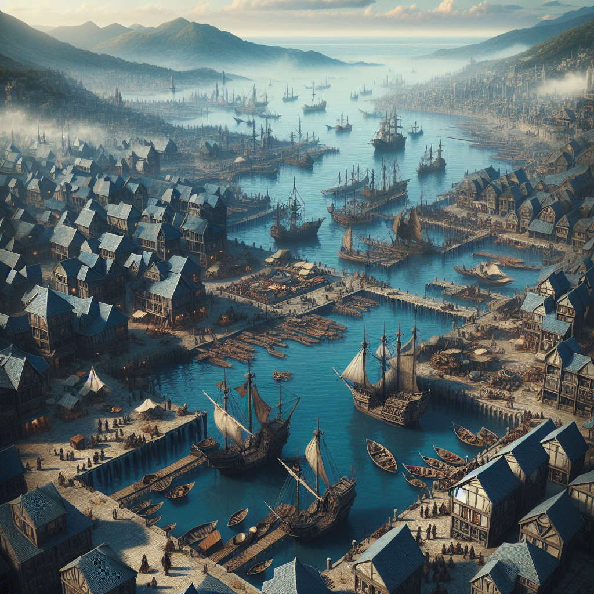
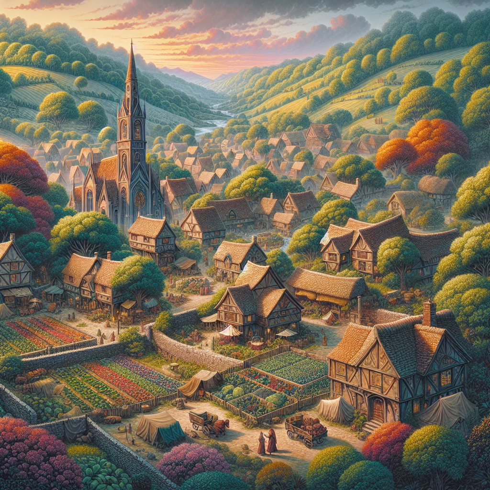

## Ombra Overview

Ombra is a region characterized by its rugged coastlines, dense forests, and a tranquil countryside. It is known for its rich maritime history and the quaint, peaceful lifestyle of its villages. Ombra's blend of scenic beauty and cultural richness makes it a unique and cherished part of the landscape.

### Port Town in Ombra

#### Port Blackwater

**Description:**  
Port Blackwater is Ombra's principal port, serving as a major center for trade and naval activity. Nestled on the edge of a large natural harbor, this town is known for its robust shipbuilding industry and bustling marketplaces.

**Key Features:**
- **Harbor Docks:** A sprawling complex of docks and warehouses where goods from across the seas are traded.
- **Shipwrights' Quarter:** Renowned for constructing and repairing sea-going vessels of all sizes.
- **Mariners' Market:** A daily market that offers fresh seafood, imported goods, and naval supplies.

**Strategic Importance:**  
As the gateway to Ombra, Port Blackwater plays a crucial role in the economic vitality of the region, facilitating trade and maintaining a strong maritime tradition.

### Village in Ombra

#### Willowbrook

**Description:**  
Willowbrook is a small, picturesque village predominantly inhabited by halflings. Located in the rolling hills of Ombra’s countryside, it is famed for its orchards, gardens, and a generally laid-back way of life.

**Key Features:**
- **The Green Gardens:** Expansive community gardens where residents grow a variety of fruits and vegetables.
- **Brookside Inn:** A cozy inn that serves as a social hub for the village and a resting spot for travelers.
- **Willow Market:** A weekly market where locals sell homemade goods, crafts, and fresh produce.

**Lifestyle:**  
Willowbrook is celebrated for its community spirit and the simple, joyful lifestyle of its residents. The halflings of this village are known for their hospitality and deep connection to the land, embracing a slow-paced and harmonious existence.

### Cultural and Natural Features

**Natural Scenery:**  
Ombra is adorned with natural beauty, from its rugged coastal cliffs and wild, sprawling forests to the gentle, verdant hills of its countryside. This diverse landscape offers a variety of outdoor activities and has inspired many local artists and poets.

**Cultural Heritage:**  
The region’s culture is a tapestry of seafaring legends, pastoral tranquility, and communal harmony. Annual festivals, local music, and storytelling are integral to Ombra’s cultural identity, celebrating its history and diverse community.

