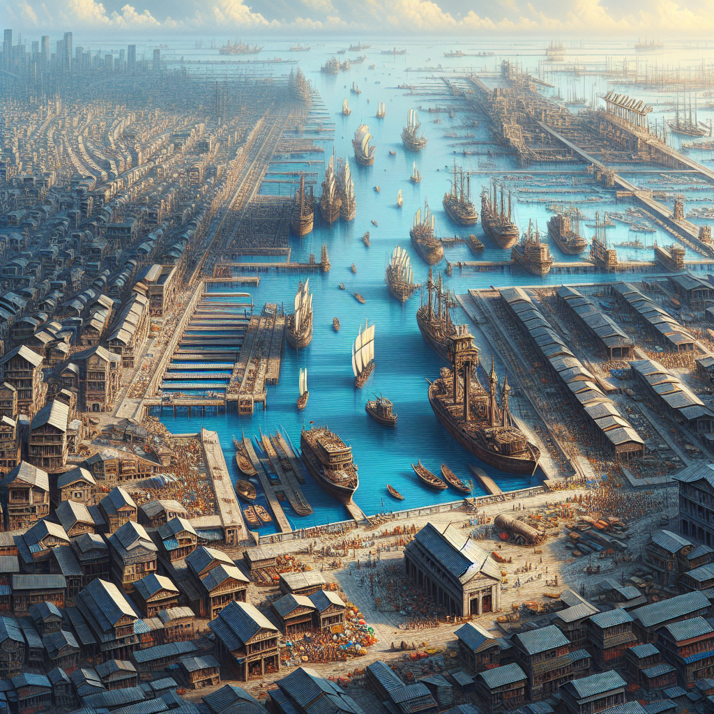
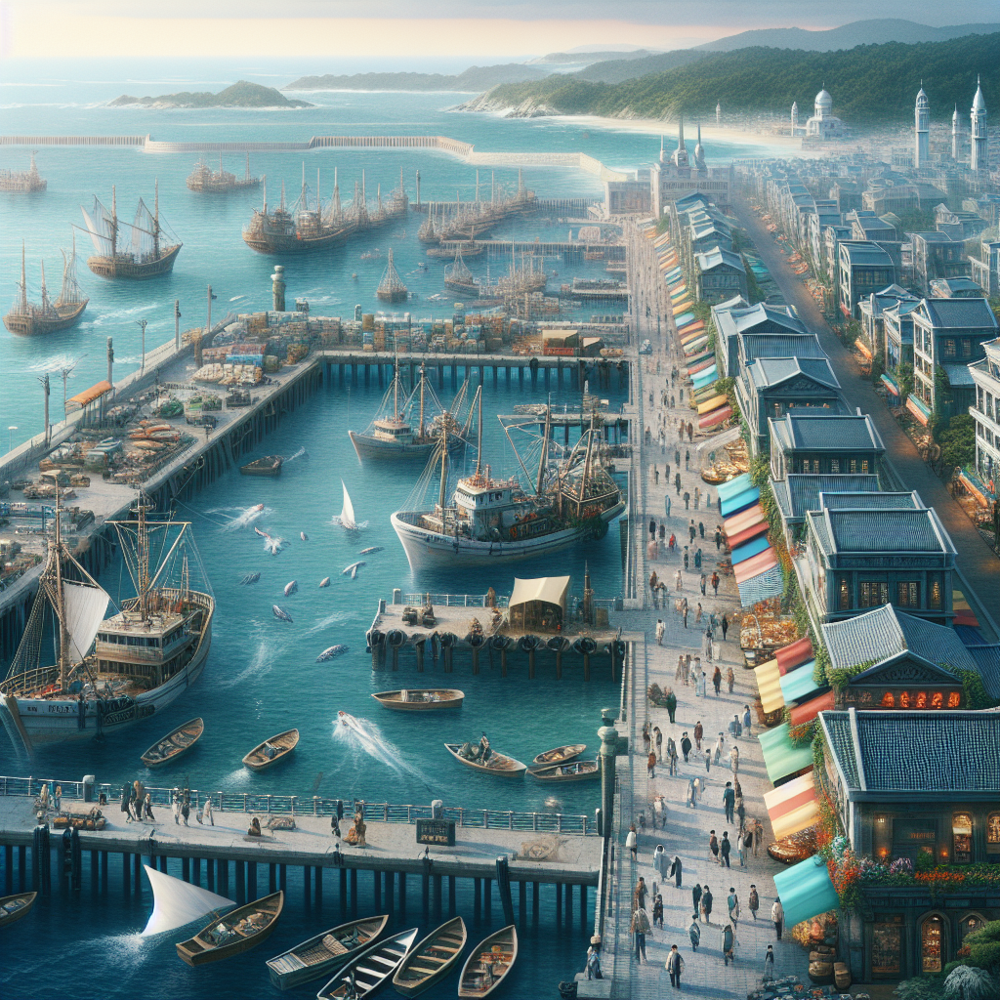
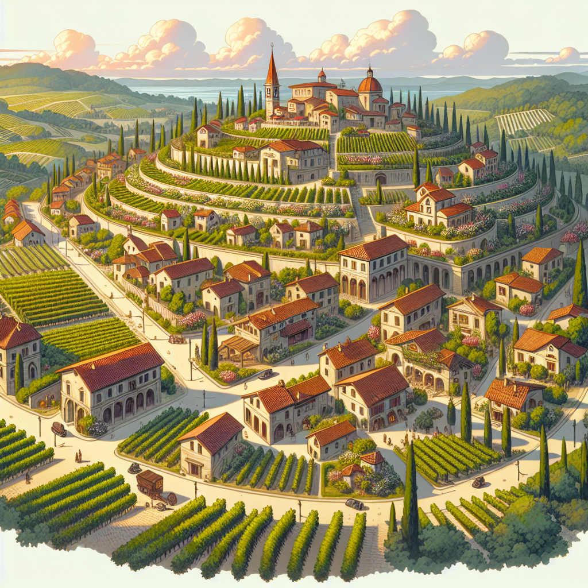

## Tirial Overview

Tirial is a diverse and expansive region known for its bustling ports, quaint towns, and a harsh western desert that is home to several small orc conclaves. The landscape varies dramatically from fertile coastal areas to rugged, arid deserts, creating a rich tapestry of cultures and ecosystems.

### Main Ports in Tirial

#### Deepwater Harbor

**Description:**  
Deepwater Harbor is one of Tirial's largest and most heavily trafficked ports. It serves as a crucial nexus for international trade and naval operations, located on the southeast coast.

**Key Features:**
- **Commercial Docks:** Equipped to handle a large volume of trade goods from across the globe.
- **Naval Base:** Provides berthing for the region’s naval fleet and includes facilities for ship repairs and maintenance.
- **Merchant Quarters:** A bustling area filled with traders, inns, and taverns catering to visitors from afar.

**Strategic Importance:**  
Deepwater Harbor is essential for Tirial’s economic prosperity, facilitating trade routes that connect to distant lands and playing a pivotal role in maritime defense.

#### Silverstrand Port

**Description:**  
Situated to the northeast, Silverstrand Port is known for its picturesque views and is a popular destination for merchants and tourists alike.

**Key Features:**
- **Fishing Docks:** The heart of the port's thriving seafood industry.
- **Marketplace:** Known for its vibrant stalls selling fresh fish, spices, and exotic imports.
- **Seaside Promenade:** A favorite spot for locals and visitors to enjoy scenic walks and local cuisine.

**Cultural and Economic Role:**  
Silverstrand Port is a major contributor to Tirial’s cultural richness and economic diversity, supporting both the fishing industry and tourism.

### Towns in Tirial

#### Greenvale

**Description:**  
Greenvale is a small agricultural town located in the heart of Tirial’s fertile plains. Known for its verdant fields and pastoral lifestyle, it is a primary supplier of grains and vegetables for the region.

**Key Features:**
- **The Grain Mills:** Utilized for processing local harvests, vital for the town’s economy.
- **Market Square:** Hosts weekly markets where farmers sell their produce.
- **Town Commons:** A gathering place for festivals and community events, celebrating harvests and local folklore.

**Lifestyle:**  
The residents of Greenvale live a peaceful, community-oriented life, with a deep connection to the land and traditional farming practices.

#### Hilltop

**Description:**  
Perched on a series of rolling hills, Hilltop is renowned for its vineyards and panoramic views. The town is a hub for wine production and attracts connoisseurs from across Tirial and beyond.

**Key Features:**
- **Vineyards:** Cover vast expanses around the town, producing several varieties of grapes.
- **Wine Guild Hall:** The center for tasting and trading local wines.
- **Artisan’s Lane:** Home to crafters and artists, adding cultural wealth to the town’s economy.

**Economy:**  
Hilltop thrives on viticulture, with its locally produced wines being highly prized both locally and internationally, bolstering the town’s prosperity.

### Western Desert

**Description:**  
The Western Desert of Tirial is a vast, arid region known for its extreme temperatures and minimal rainfall. Despite its harsh conditions, it is home to several orc conclaves, known for their resilience and warrior culture.

**Key Features:**
- **Orc Conclaves:** Small, fortified settlements scattered throughout the desert, each ruled by its own chieftain.
- **The Oasis of Gor’Thak:** A vital water source around which several conclaves gather for trade and parley.
- **The Sandsea Dunes:** Large, shifting dunes that are both a natural challenge and a defense against intruders.

**Cultural Significance:**  
The orc conclaves of the Western Desert are steeped in traditions of survival, honor, and combat, contributing to the diversity of Tirial’s cultural landscape.
