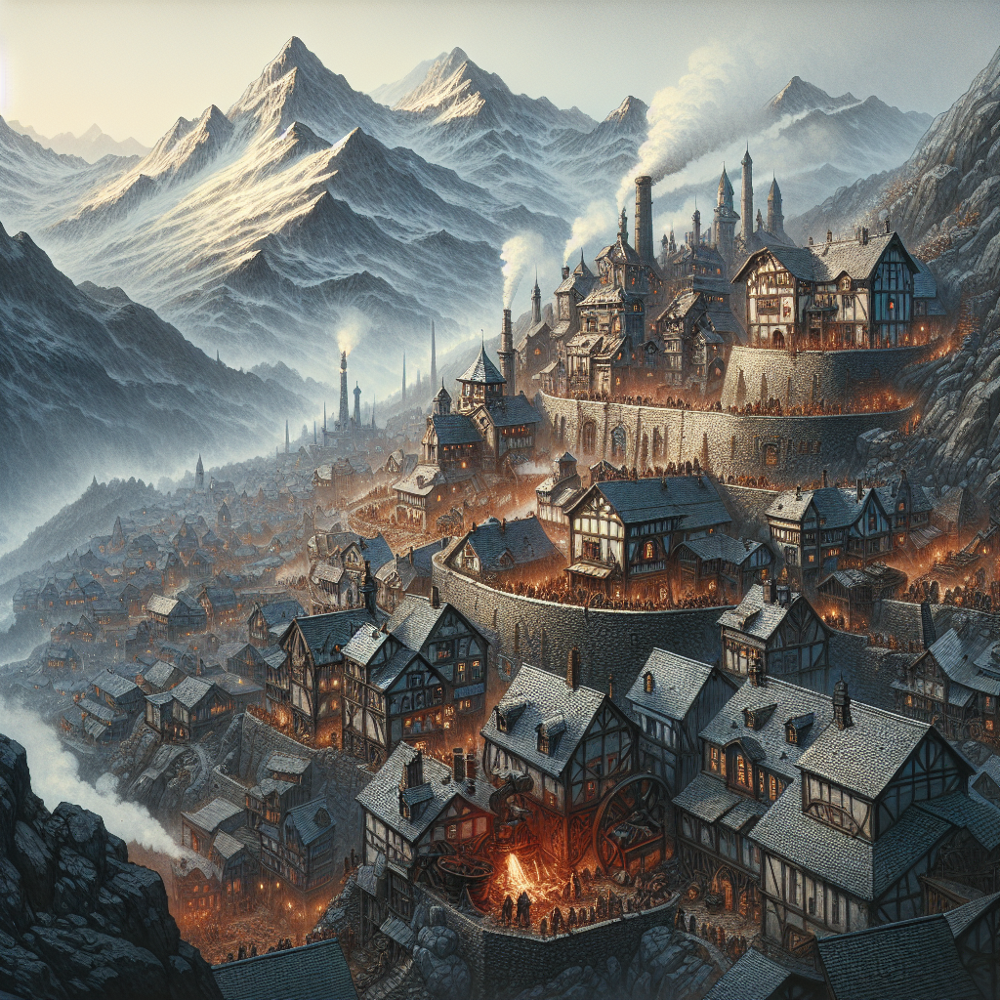
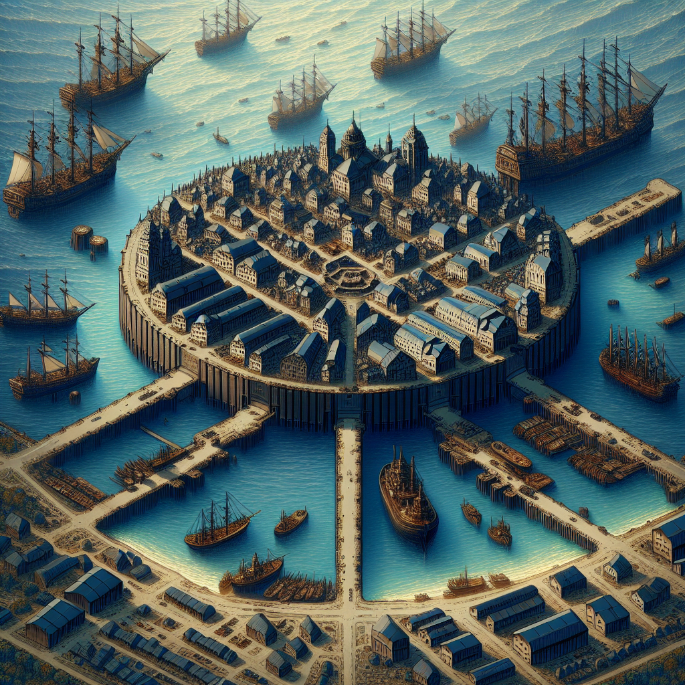
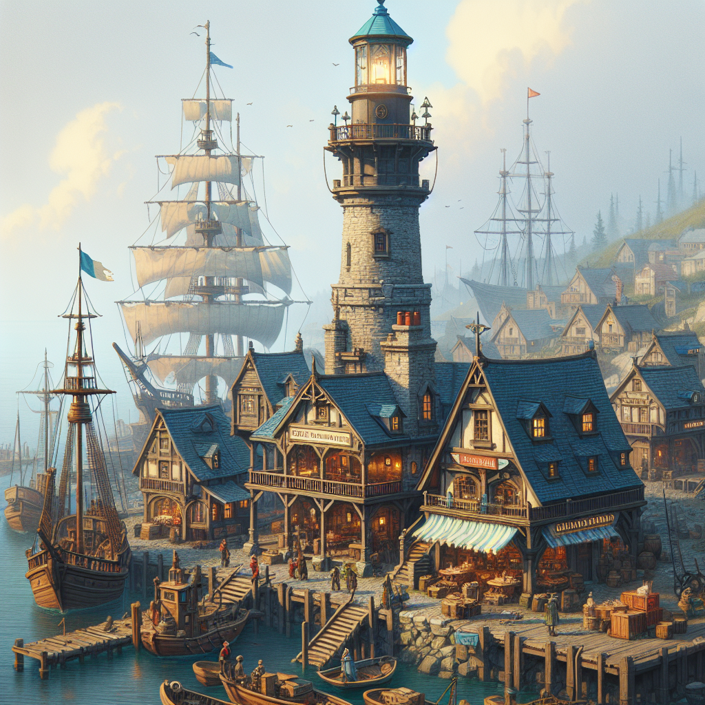

## Towns and Ports of Vardun

### Towns

#### Ironhall

**Description:**  
Ironhall is a bustling town centered around its prosperous iron mines and skilled metalworkers. Located in a mountainous area, the town is strategically significant due to its production of superior iron and steel.

**Key Features:**
- **The Iron Mines:** Central to Ironhall’s economy, providing iron and other minerals.
- **The Anvil Square:** The commercial and social hub surrounded by smithies and metal workshops.
- **The Barracks of the Mountain Guard:** Ensures the security of the town and its valuable resources.

**Culture & Economy:**  
The town thrives on its iron and steel industry, with a community that celebrates strength, resilience, and craftsmanship through annual festivals and competitions.

#### Mistvale

**Description:**  
Mistvale is a secluded town hidden within a dense, mist-covered forest in northern Vardun. The town is rarely visited by outsiders due to its remote location and the challenging terrain that surrounds it.

**Key Features:**
- **The Whispering Woods:** A source of both protection and mystical lore.
- **The Elder Hall:** Built around an ancient tree, serving as the communal heart of Mistvale.
- **The Hidden Paths:** Secret trails that safeguard the town from larger predators and unwelcome intruders.

**Culture & Economy:**  
Connected deeply to the forest, the residents specialize in forestry, herbalism, and hunting. Mistvale maintains a mystical reputation, with traditions steeped in ancient forest lore.

### Ports

#### Southwatch Harbor

**Description:**  
Southwatch Harbor is a fortified port city south of the capital, serving as a crucial naval base and a bustling commercial harbor, connecting Vardun with southern territories.

**Key Features:**
- **The Iron Docks:** Strongly built to accommodate both military and trade ships.
- **The Naval Command:** Headquarters for the southern naval fleet and shipbuilding facilities.
- **Market Quarters:** A vibrant area where traders from various regions exchange goods.

**Strategic Importance:**  
As a vital economic gateway and defensive outpost, Southwatch Harbor is essential for both trade and security against naval threats from the south.

#### Eastwind Anchorage

**Description:**  
Located on the eastern coast of Vardun, Eastwind Anchorage is a bustling port known for its shipbuilding and fishing industries. It is a vital stopover for ships traveling along the eastern trade routes.

**Key Features:**
- **Shipwrights' Guild:** Drives the local economy with ship construction and repair services.
- **The Sailor’s Rest:** Provides food, lodging, and news for sailors and travelers.
- **Lighthouse of the Eastern Beacon:** Guides ships safely into port and serves as a lookout.

**Cultural and Economic Role:**  
Eastwind Anchorage is crucial for Vardun's fishing industry and serves as a cultural hub due to its strategic location on busy trade routes.
